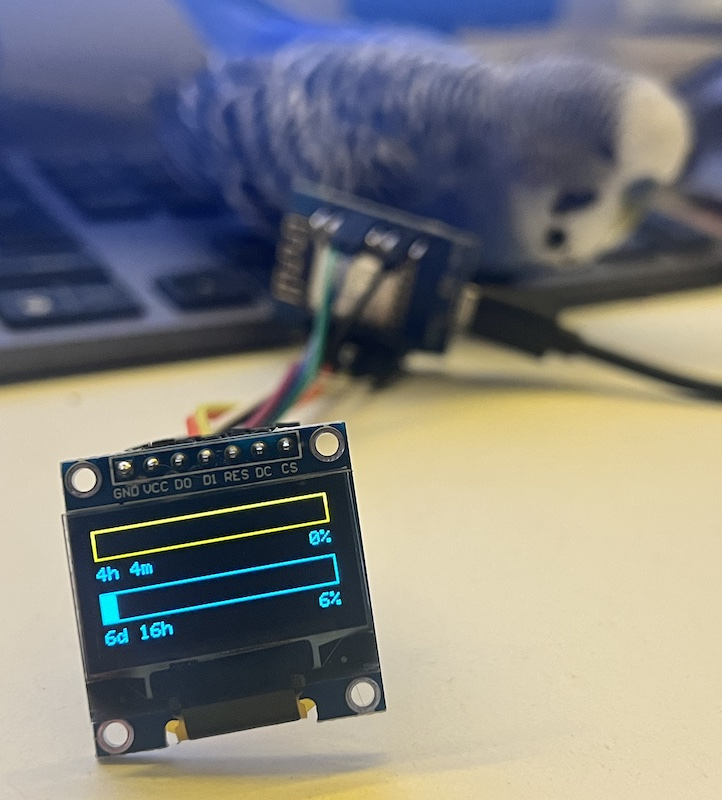

# What is this?

This project is a small desktop “ticker” built with a Wemos D1 mini (ESP8266) and a 0.96" OLED display (SSD1306) that continuously shows the current usage of your Claude Code limits (the 5-hour and 7-day windows). It receives fresh JSON updates (every 5 minutes) over local Wi-Fi, turns those values into clean full-width progress bars, and displays the corresponding reset times, so you can see at a glance how much quota you have left and when it replenishes—without opening an app or storing any sensitive access tokens on the device.

# HW:
##  3-wire SPI OLED → Wemos D1 mini (ESP8266)

| OLED pin | Wemos pin | GPIO |
|---|---:|---:|
| **D0** (SCK/CLK) | **D5** | GPIO14 |
| **D1** (MOSI/DIN) | **D7** | GPIO13 |
| **DC** | **D2** | GPIO4 |
| **RST/RES** | **D1** | GPIO5 |
| **CS** | **D0** | GPIO16 |
| **VCC** | **3V3** |
| **GND** | **GND** |

## 0.96" OLED 
Wemos OLED, 128x64 = https://www.aliexpress.com/item/1005009923777658.html (two-colored is nice)

## 3D printed enclosure 
Something like https://www.printables.com/model/510481-terminal-for-ssd1306-096-oled-and-wemos-d1-mini

## Run backend:
Works only on OSX because of stored accesstoken in system keychain; token is NEVER sent anywhere

`npm install`

`node index.js`

## Preview:

